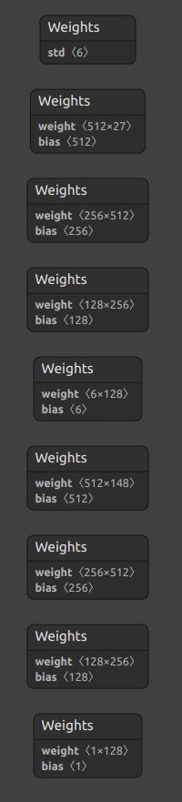
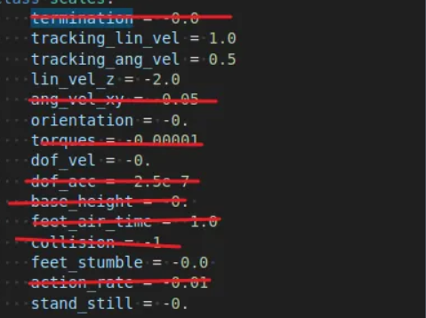
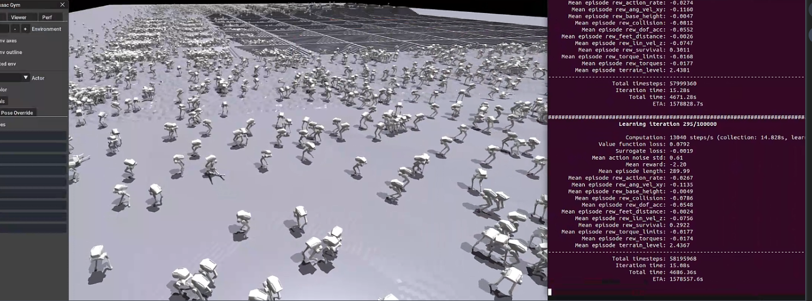

### model structure

input dim: 27 dim proprioception

output dim: 6 dim action 



### specified ```is_sim=True``` when deploy in simulation

```
robot = Robot(RobotType.PointFoot, is_sim=True)
```
###  rewards which exist in ```legged_gym``` but not exist in the repo that TA offer

# experiment after adding ```lin_vel_z``` to the reward function
### Mean episode length reach 270 after adding ```lin_vel_z```


checkpoint of ```model_36000.pt```


