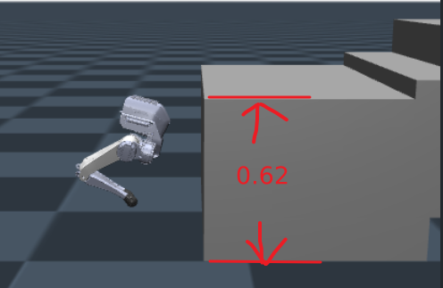
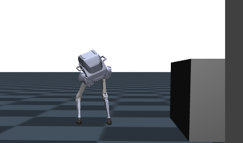

### model structure

input dim: 27 dim proprioception

output dim: 6 dim action 


### specified ```is_sim=True``` when deploy in simulation

```
robot = Robot(RobotType.PointFoot, is_sim=True)
```
####  rewards which exist in ```legged_gym``` but not exist in the repo that TA offer


# experiment after adding ```lin_vel_z``` to the reward function
### reward += ```lin_vel_z```


#### checkpoint of 35000
checkpoint of ```model_36000.pt```

we can notice that tron cannot **stand still** and it **rotates** when there is no command

export as policy01.onnx
### reward += 
-  ```_reward_orientation``` 
- ```_reward_stand_still```
if does not work, when training it does not converge

export as policy02.onnx

###  reward += 
- ```unbalance_feet_air_time```
- ```unbalance_feet_height```
-  ```no_fly```
- ```tracking_lin_vel```
- ```tracking_ang_vel```

export as policy03.onnx

the results shows that the robot crawl forward. The base of tron is two low. So I increase change the scale of reward base_height from ```-2``` to ```-10```

### scale of reward base_height from ```-2``` to ```-10```
it performs well but the gait frequency is so fast, which is not energy efficient in deploy.
export as policy04.onnx

### scale of feetair time from ```0``` to ```10```
tron gait frequency is two low, base height is not enough. and when there is no command it will moving.
export as policy05.onnx

### increase target_base_height and reduce feet air time scale

the robot will be easily fall

and actually the tron never rich the disire base height target 0.62


参考原来的能站起来的 base height 
